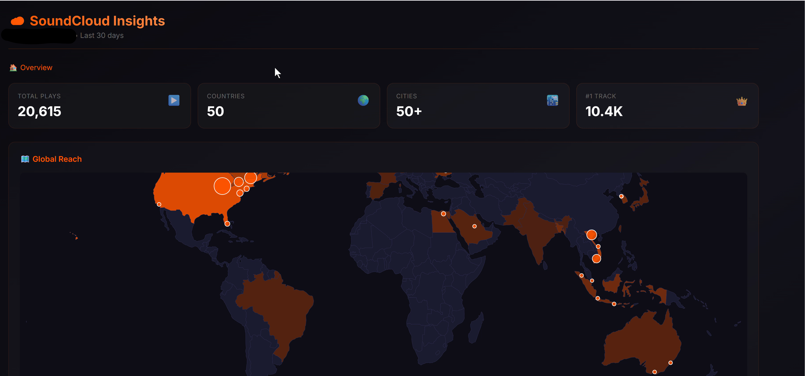

# SoundCloud Insights Toolkit

Scrape your SoundCloud analytics and visualize listener geography with an interactive dashboard.

No official API access needed — just your browser cookies.



## Features

- 📊 **Track Metrics** — plays, likes, reposts, comments for all your tracks
- 🌍 **Geographic Data** — countries and cities where your music is played
- 🗺️ **Interactive Map** — visualize your global reach
- 🔄 **Drill-down Navigation** — Track → Countries → Cities (and reverse)

## Quick Start

### 1. Get Your OAuth Token

1. Log into [SoundCloud](https://soundcloud.com) in Chrome
2. Open DevTools (`F12`) → **Application** → **Cookies** → `soundcloud.com`
3. Find `oauth_token` and copy its value (looks like `2-309337-1234567-xxxxx`)

### 2. Set Environment Variable

**Option A: Environment variable**
```bash
# Windows
set SOUNDCLOUD_OAUTH_TOKEN=your_token_here

# Mac/Linux
export SOUNDCLOUD_OAUTH_TOKEN=your_token_here
```

**Option B: Create a `.env` file**
```
SOUNDCLOUD_OAUTH_TOKEN=your_token_here
```

### 3. Install Dependencies

```bash
pip install -r requirements.txt
```

### 4. Run the Scrapers

```bash
# Get basic track metrics (plays, likes, etc.)
python soundcloud_scraper.py

# Get geographic insights (countries, cities per track)
python soundcloud_insights.py
```

### 5. Launch the Dashboard

```bash
# Copy the data file
cp soundcloud_insights.json soundcloud_dashboard/

# Run the dashboard
cd soundcloud_dashboard
python app.py
```

Open http://localhost:5000

## Scripts

| Script | Purpose | Output |
|--------|---------|--------|
| `soundcloud_scraper.py` | Track metrics (plays, likes, etc.) | `soundcloud_metrics.csv` |
| `soundcloud_insights.py` | Geographic data per track | `soundcloud_insights.json` |
| `soundcloud_dashboard/app.py` | Flask dashboard | Web UI on port 5000 |

## Dashboard Navigation

- **Overview** → Click a track → See countries/cities for that track
- **Overview** → Click a country → See tracks popular in that country
- **Track view** → Click a country → See cities in that country for that track
- Use breadcrumbs to navigate back

## How It Works

SoundCloud doesn't offer a public API for analytics, but their web dashboard uses internal GraphQL endpoints. These scripts:

1. Authenticate using your OAuth token (from browser cookies)
2. Call the same APIs that the SoundCloud Insights dashboard uses
3. Aggregate and export the data for offline analysis

**This only accesses your own data.** You're just automating what you could do manually in the browser.

## Token Expiration

Your OAuth token expires periodically. If you get auth errors:

1. Log into SoundCloud again in your browser
2. Grab a fresh token from DevTools
3. Update your environment variable or `.env` file

## Security Notes

⚠️ **Never commit your OAuth token to git!**

The `.gitignore` excludes:
- `.env` files
- `soundcloud_insights.json` (contains your token in requests)
- Any `*.csv` or `*.json` data files

## License

MIT — do whatever you want with it.

